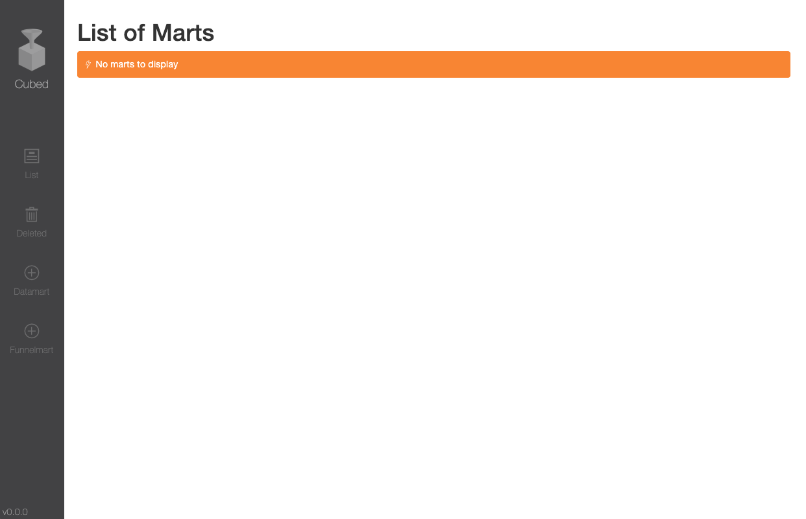
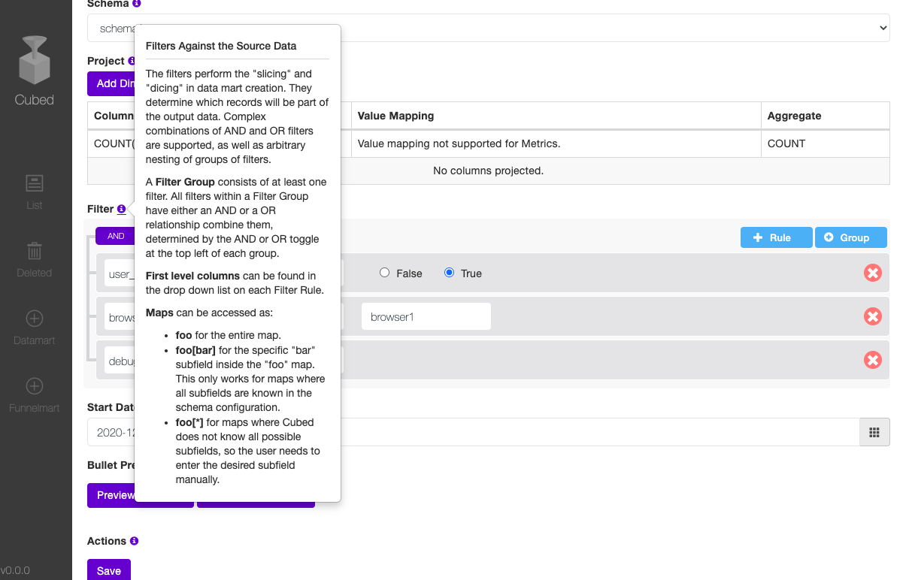

# Cubed

[](https://github.com/yahoo/cubed/actions?query=workflow%3Abuild)
[](LICENSE)

Cubed is a self-serve data mart and funnel analysis pipeline management platform.  

## Table of Contents

- [Background](#background)
- [Install](#install)
- [Configuration](#configuration)
- [Usage](#usage)
- [Security](#security)
- [Contribute](#contribute)
- [License](#license)

## Background
Do you find it difficult deriving insights from wide and sparse data sets, and want to only focus on data relevant to your needs?  

Do you want to study the user conversions across multiple interaction points in your product? Or, do you find it difficult to build Funnel Analysis pipelines?  

Are the out-of-the-box reporting tools in your company are too generic, limited in depth, and unable to provide the metrics you are looking for?  

If so, Cubed is for you.

### Datamart  
The [data mart](https://en.wikipedia.org/wiki/Data_mart) is a subset of the data warehouse and is usually oriented to a specific business line or team. While the data warehouse is usually huge and wide, the data mart is smaller and more manageable for product teams. Data marts can be built via slicing and dicing ETL pipelines built on top of data warehouses. However, building such data pipelines usually is not a product team’s specialty. They will need to understand the proper tech stacks to select, working with clusters, scheduling, CI/CD, data model optimization, data presentation, etc.

Cubed provides a data mart as-a-service experience for product team users. Once Cubed has been deployed by the data team, product teams across the company can self-serve to create data marts with easy-to-use UI within a few minutes. Users can deploy their data marts to production and have them run regularly. BI tools can be built on data mart results to provide visualizations and reportings.

### Funnelmart  
The funnel mart is a collection of funnels oriented to a specific business line or team. A funnel is used in Funnel Analysis. [Funnel analyses](https://apsalar.com/2013/01/using-funnel-analysis-to-measure-user-conversion-rates/) are an effective way to calculate conversion rates on specific user behaviors. In the real world, analyzing a single funnel is usually not enough because users can take different paths to reach a goal, and there are usually multiple user journeys to study inside a product. The product team needs to compare multiple funnels to understand their ability to convert users. Similar to data marts, funnel marts are built on top of data warehouses via ETL pipelines, and building such ETL pipelines is difficult.  

Cubed provides a funnel mart as-a-service experience for product team users. On Cubed, a user can define multiple critical user interaction points using the UI, and they can be dragged, dropped, and connected to form a user journey graph across the product. Cubed can interpret underlying funnels and schedule them to run regularly. The comprehensive user flow can be visualized in a Sankey chart, and it can be drilled down to visualize individual funnel conversions.  


## Install
### Components
A fully-functional Cubed requires the following components:  
1. A running Cubed instance (be built using this repo).
2. An [HCatalog](https://cwiki.apache.org/confluence/display/Hive/HCatalog) registered data source or multiple HCatalog registered data sources.
3. [Oozie](https://oozie.apache.org/), the workflow scheduler system.
4. A [Druid](https://druid.apache.org/) cluster.
5. [HDFS](https://hadoop.apache.org/docs/r1.2.1/hdfs_design.html).
6. (Funnel mart only) [Hive-funnel-udf](https://github.com/yahoo/hive-funnel-udf) registered on [Hive](https://hive.apache.org/).
7. (Optional) BI tools that support Druid connections, such as [Superset](https://superset.incubator.apache.org/), [Turnilo](https://github.com/allegro/turnilo), or [Looker](https://looker.com/).
8. (Optional) A [Bullet](https://bullet-db.github.io/) service, used for data mart cardinality estimation.

In this section we only introduce how we can install Cubed. Configurations regarding Hive, Oozie, Druid cluster, BI tools, and Bullet service are introduced in the [Configuration](#configuration) Section.

### Quick Installation of Cubed
1. Clone this repo.
2. `make run` to build and run Cubed on localhost using default settings (Java 8 and [Maven](https://maven.apache.org/) are needed).

## Configuration
### Configuration Parameters
Here is a comprehensive list of all the configuration parameters that can be passed via command line.  

| Parameter        | Description           | Example (Default Value)  |
| :-------------: |:-------------:| :-----:|
|`--help`      | Display help message or not. | false |
|`--version`      | The version number you assign.      |   0.0.0 |
|`--user-name` | User name used for managing pipelines. | cubed_user |
|`--schema-files-dir` | Directory of schema files path.      |    src/test/resources/schemas |
|`--db-config-file` | Database configuration file. | src/main/resources/database-configuration.properties |
|`--pipeline-scripts-path` | Local path for the scripts used for starting and stopping a pipeline. | src/main/resources/bin/ |
|`--sketches-hive-jar-path` | Local path for the Sketches Hive jar. | lib/ |
|`--instance-name` | Name of the cubed instance. | cubed |
|`--pipeline-owner` | Pipeline owner name, usually depends on environment (prod, stg, dev). | prod |
|`--hdfs-output-path` | HDFS output path for data. | /projects/cubed |
|`--pipeline-deploy-path` | HDFS Path for Oozie pipeline configurations. | /user/cubed_user/cubed |
|`--trash-dir` | HDFS trash directory. | hdfs:///user/cubed_user/.Trash |
|`--job-tracker-url` | Hadoop job tracker URL. | jobtracker.cubed.com:8080 |
|`--name-node-url` | Hadoop name node URL. | hdfs://namenode.cubed.com:8080 |
|`--hcat-uri` | HCatalog URI. | hcat://hcatalog.cubed.com:8080 |
|`--hcat-principal` | Hcatalog principal. | hcat/hcat.cubed.com@random.com |
|`--oozie-ui-url` | Oozie UI URL. | https://oozie.cubed.com:8080/oozie |
|`--hive-jdbc-url` | Hive JDBC URL. | jdbc:hive2://hive.cubed.com:8080/default |
|`--oozie-url` | Oozie URL. | https://oozie.cubed.com:8080/oozie |
|`--druid-indexer` | Druid indexer host. | cubed-indexer.cubed.com:8080 |
|`--druid-http-proxy` | Druid HTTP proxy used for loading data into Druid. | http://httpproxy.cubed.com:8080 |
|`--turnilo-url` | URL for the Turnilo BI tool (`%s` is used for variable replacement). | http://turnilo.cubed.com:8080/#%s_%s |
|`--superset-url` | URL for the Superset BI tool. | http://superset.cubed.com |
|`--cardinality-cap` | Cardinality cap for Bullet (if enabled). | 50 |
|`--hdfs-servers` | Remote cluster hdfs servers to support. | hdfs://hdfs-servers.cubed.com |
|`--port` | Port the Cubed service is running on. | 9999 |
|`--threads` | Number of threads Cubed uses. | 200 |
|`--template-output-dir` | Datamart and funnelmart template output folder on HDFS. | /tmp |
|`--pipeline-email` | Email to receive Oozie pipeline failures. | this-email-does-not-exist@cubed.com |
|`--queue` | Queue used for Oozie pipelines. | adhoc |
|`--bullet-query-duration` | Bullet query duration in seconds. | 15 |

In order to make sure the datamart and funnelmart pipelines can be launched and run, aside from the parameters mentioned above, here are the additional parameters needed to be specified in the shell scripts under `src/main/resources/bin`:

| Parameter        | Description           |
| :-------------: |:-------------:|
|`$(PATH)`      | The `PATH` environment variable specifying where executables are located. |
|`$(CLASSPATH)`      | The Java `CLASSPATH` environment variable. |
|`$(JAVA_HOME)`      | Java home directory on local server.      |
|`$(HADOOP_HOME)` | Hadoop home directory on local server. |
|`$(HADOOP_CONF_DIR)` | Hadoop configurations directory on local server. |
|`$(HADOOP_COMMON)` | Hadoop common directory on local server. |
|`$(HIVE_HOME)` | Hive home directory on local server. |
|`$(HIVE_JDBC_HOME)` | Hive JDBC home directory on local server. |
|`$(DRUID_COORD)` | Druid coordinator URL.  |
|`$(DEST_FOLDER)` | The destination folder that datamart and funnelmart oozie pipeline definitions stores into.  |
|`$(LOG_PROPERTIES_FILE)` | The location of the log4j properties (usually named as `log4j.properties`) file.  |

### Onboard Your Own Schemas
The `--schema-files-dir` parameter is where you can put your own schema specifications. It's default value is `src/test/resources/schemas` and you can find examples in this folder. Under `--schema-files-dir`, each schema has its own folder. The folder name is used as the schema name in Cubed. Inside the folder, to yaml files are needed, one for the schema and one for the schema specific operational parameters. The schema file name should contain the keyword "schema", and the operational parameter file should contain the keyword "operational".

#### A sample schema file
```yaml

---
schemas:
- tables:
    daily_table: "daily_data"
    hourly_partition: "dt=${YEAR}${MONTH}${DAY}${HOUR}"
    daily_partition: "dt=${YEAR}${MONTH}${DAY}"
    hourly_table: "hourly_data"
  fields:
  - name: "timestamp"
    type: "integer"
    id: 1
  - name: "cookie_one"
    type: "string"
    id: 2
  - name: "browser"
    type: "string"
    id: 3
  - name: "geo_info"
    type: "map<string,string>"
    id: 4
    keys:
    - name: "city"
      id: 40001
    - name: "state"
      id: 40002
    - name: "country"
      id: 40003
  - name: "user_logged_in"
    type: "boolean"
    id: 5
  - name: "debug_tag"
    type: "map<string,boolean>"
    id: 6
    keys:
    - name: "is_ok"
      id: 60001
    - name: "is_deleted"
      id: 60002
  - name: "cookie_two"
    type: "string"
    id: 7
  - name: "random_info_one"
    type: "map<string,string>"
    id: 8
  - name: "random_info_two"
    type: "map<string,string>"
    id: 9
  - name: "user_event"
    type: "string"
    id: 10
  - name: "cookie_one_age"
    type: "string"
    id: 11
  - name: "cookie_one_info"
    type: "map<string,string>"
    id: 12
    keys:
    - name: "version"
      id: 12001
    - name: "age"
      id: 12002
  - name: "network_status"
    type: "string"
    id: 13
  - name: "device"
    type: "string"
    id: 14
  - name: "bucket"
    type: "integer"
    id: 15
  - name: "property"
    type: "string"
    id: 16
  - name: "content_id"
    type: "string"
    id: 17
  name: "schema1"
  database: "schema1"
```

Valid types: `boolean`, `string`, `integer`, `float`, `map<string,string>`, `map<string,boolean>`, `map<string, integer>`, `map<string, float>`

If you have a map type column, you can add enumerated keys with the `keys` field.

Within each schema, you must provide a non-duplicate integer ID for each field and key.

#### A sample operational parameters file
```yaml
# Bullet APIs URL
bulletUrl: cubed

# Disable bullet validataion
disableBullet: false

# Disable funnel support
disableFunnel: false

# Oozie job type
oozieJobType: "hourly"

# Oozie backfill job type
oozieBackfillJobType: "daily"

# Target table used in funnel queries
funnelTargetTable: "daily_data"

# User id fields
userIdFields: 
  - "cookie_one"
  - "cookie_two"

# Default filters
defaultFilters:
  - id: "user_logged_in"
    operator: "equal"
    value: 1
  - id: "browser"
    operator: "equal"
    value: "browser1"
  - id: "debug_tag"
    operator: "is_null"

# Hql timestamp column attribute
timestampColumnParam: "timestamp"
```

## Usage
After Cubed has been successfully booted, you will be able to see a welcome page: 

This page is supposed to list all the data marts and funnel marts, and it is filtered by the "Deployed" status by default. If here has saved marts listed, you can click into each mart to view the details. Or you can create a new data mart or a new funnel mart by clicking the plus button on the left navigation bar.

After clicking the plus button to create a new data mart or a funnel mart, you will be prompted to select a schema. After selecting the schema you are going to work on, you will be directed to the data mart or funnel mart creation page: 

You can find a tooltip button next to each key feature. You can learn the usage of each feature by reading the information provided.

## Security
### Secure Communication Warning
Currently Cubed does not have in-transit encryption (such as TLS) or authentication implemented in the code base.

#### Security Vulnerabilities
Without in-transit encryption and authentication, an attacker suitably positioned to view a legitimate user's network traffic could record and monitor their interactions with the application and obtain any information the user supplies. Furthermore, an attacker able to modify traffic could use the application as a platform for attacks against its users and third-party websites. Unencrypted connections have been exploited by ISPs and governments to track users, and to inject adverts and malicious JavaScript.  

Taking these vulnerabilities into consideration, we highly recommend you to implement your custom in-transit encryption and authentication mechanism in your production system. Building and running Cubed as-is should be limited to development or prototyping purpose only, or limiting its access to only the local server where Cubed is running.  

#### Secure Communication Suggestions
There are multiple ways to customly implement in-transit encryption and authentication, and here are some suggestions:  
##### In-transit Encryption via Istio
[Istio](https://istio.io/latest/docs/concepts/what-is-istio/) makes it easy to create a network of deployed services with load balancing, service-to-service authentication, monitoring, and more, with few or no code changes in service code. You add Istio support to services by deploying a special sidecar proxy throughout your environment that intercepts all network communication between microservices, then configure and manage Istio using its control plane functionality.  

In Verizon Media, we run Cubed on [Kubernetes](https://kubernetes.io/) with Istio to achieve in-transit encryption. It introduced no change to the Cubed core code base.  

##### Authentication via Pac4j
[Pac4j](https://www.pac4j.org/) is a Java security engine can be used to protect web applications and web services. Cubed uses the [SparkJava](https://sparkjava.com/) web application microframework, and it can make use of the [spark-pac4j](https://github.com/pac4j/spark-pac4j). The `spark-pac4j` project is an easy and powerful security library for Sparkjava web applications and web services which supports authentication and authorization, but also logout and advanced features like session fixation and CSRF protection.  

##### Custom Authentication Needs Beyond Pac4j
Although Pac4j is a powerful and versatile authentication library, still there could be custom authentication needs (e.g. specific authentication libraries written in your company) that could not be fulfilled by it. If this applies to you, you can either directly modify the code, or use [other web servers](https://sparkjava.com/documentation#other-web-server) instead of the embedded jetty server used in SparkJava. if using other web servers (e.g. [Apache Tomcat](http://tomcat.apache.org/)) , you can add an authentication servlet filter ahead of Cubed.  

### Known Third Party Dependency Vulnerabilities
While the majority of dependencies have been upgraded to their latest versions, in some cases there are still published vulnerabilities, either due to second-order dependencies that have not been updated by the package maintainers (most common) or compatibility issues preventing an upgrade.  
**apache-jsp-9.3.20.v20170531.jar**: [CVE-2017-7658](https://cve.mitre.org/cgi-bin/cvename.cgi?name=CVE-2017-7658),[CVE-2017-7657](https://cve.mitre.org/cgi-bin/cvename.cgi?name=CVE-2017-7657)  
**api-util-1.0.0-M20.jar**: [CVE-2018-1337](https://cve.mitre.org/cgi-bin/cvename.cgi?name=CVE-2018-1337)  
**hadoop-yarn-server-common-3.1.0.jar**: [CVE-2018-8029](https://cve.mitre.org/cgi-bin/cvename.cgi?name=CVE-2018-8029),[CVE-2018-8009](https://cve.mitre.org/cgi-bin/cvename.cgi?name=CVE-2018-8009)  
**hbase-hadoop-compat-2.3.3.jar**: [CVE-2018-8029](https://cve.mitre.org/cgi-bin/cvename.cgi?name=CVE-2018-8029),[CVE-2016-6811](https://cve.mitre.org/cgi-bin/cvename.cgi?name=CVE-2016-6811),[CVE-2018-8009](https://cve.mitre.org/cgi-bin/cvename.cgi?name=CVE-2018-8009)  
**hbase-protocol-shaded-2.3.3.jar/META-INF/maven/com.fasterxml.jackson.core/jackson-databind/pom.xml**: [CVE-2020-9547](https://cve.mitre.org/cgi-bin/cvename.cgi?name=CVE-2020-9547),[CVE-2017-17485](https://cve.mitre.org/cgi-bin/cvename.cgi?name=CVE-2017-17485),[CVE-2018-5968](https://cve.mitre.org/cgi-bin/cvename.cgi?name=CVE-2018-5968),[CVE-2020-9548](https://cve.mitre.org/cgi-bin/cvename.cgi?name=CVE-2020-9548),[CVE-2020-14195](https://cve.mitre.org/cgi-bin/cvename.cgi?name=CVE-2020-14195),[CVE-2020-24616](https://cve.mitre.org/cgi-bin/cvename.cgi?name=CVE-2020-24616),[CVE-2020-10969](https://cve.mitre.org/cgi-bin/cvename.cgi?name=CVE-2020-10969),[CVE-2020-11619](https://cve.mitre.org/cgi-bin/cvename.cgi?name=CVE-2020-11619),[CVE-2020-10968](https://cve.mitre.org/cgi-bin/cvename.cgi?name=CVE-2020-10968),[CVE-2019-20330](https://cve.mitre.org/cgi-bin/cvename.cgi?name=CVE-2019-20330),[CVE-2020-24750](https://cve.mitre.org/cgi-bin/cvename.cgi?name=CVE-2020-24750),[CVE-2020-10673](https://cve.mitre.org/cgi-bin/cvename.cgi?name=CVE-2020-10673),[CVE-2020-11620](https://cve.mitre.org/cgi-bin/cvename.cgi?name=CVE-2020-11620),[CVE-2018-11307](https://cve.mitre.org/cgi-bin/cvename.cgi?name=CVE-2018-11307),[CVE-2018-14718](https://cve.mitre.org/cgi-bin/cvename.cgi?name=CVE-2018-14718),[CVE-2018-7489](https://cve.mitre.org/cgi-bin/cvename.cgi?name=CVE-2018-7489),[CVE-2019-17531](https://cve.mitre.org/cgi-bin/cvename.cgi?name=CVE-2019-17531),[CVE-2020-10672](https://cve.mitre.org/cgi-bin/cvename.cgi?name=CVE-2020-10672),[CVE-2019-14540](https://cve.mitre.org/cgi-bin/cvename.cgi?name=CVE-2019-14540),[CVE-2020-9546](https://cve.mitre.org/cgi-bin/cvename.cgi?name=CVE-2020-9546),[CVE-2020-14060](https://cve.mitre.org/cgi-bin/cvename.cgi?name=CVE-2020-14060),[CVE-2020-14061](https://cve.mitre.org/cgi-bin/cvename.cgi?name=CVE-2020-14061),[CVE-2017-15095](https://cve.mitre.org/cgi-bin/cvename.cgi?name=CVE-2017-15095),[CVE-2020-14062](https://cve.mitre.org/cgi-bin/cvename.cgi?name=CVE-2020-14062),[CVE-2019-16942](https://cve.mitre.org/cgi-bin/cvename.cgi?name=CVE-2019-16942),[CVE-2019-16943](https://cve.mitre.org/cgi-bin/cvename.cgi?name=CVE-2019-16943),[CVE-2017-7525](https://cve.mitre.org/cgi-bin/cvename.cgi?name=CVE-2017-7525),[CVE-2020-11113](https://cve.mitre.org/cgi-bin/cvename.cgi?name=CVE-2020-11113),[CVE-2019-17267](https://cve.mitre.org/cgi-bin/cvename.cgi?name=CVE-2019-17267),[CVE-2019-16335](https://cve.mitre.org/cgi-bin/cvename.cgi?name=CVE-2019-16335),[CVE-2020-11112](https://cve.mitre.org/cgi-bin/cvename.cgi?name=CVE-2020-11112),[CVE-2019-14893](https://cve.mitre.org/cgi-bin/cvename.cgi?name=CVE-2019-14893),[CVE-2020-11111](https://cve.mitre.org/cgi-bin/cvename.cgi?name=CVE-2020-11111),[CVE-2020-8840](https://cve.mitre.org/cgi-bin/cvename.cgi?name=CVE-2020-8840)  
**hbase-zookeeper-2.3.3.jar**: [CVE-2016-5017](https://cve.mitre.org/cgi-bin/cvename.cgi?name=CVE-2016-5017)  
**jackson-mapper-asl-1.9.13.jar**: [CVE-2017-17485](https://cve.mitre.org/cgi-bin/cvename.cgi?name=CVE-2017-17485),[CVE-2018-5968](https://cve.mitre.org/cgi-bin/cvename.cgi?name=CVE-2018-5968),[CVE-2017-15095](https://cve.mitre.org/cgi-bin/cvename.cgi?name=CVE-2017-15095),[CVE-2017-7525](https://cve.mitre.org/cgi-bin/cvename.cgi?name=CVE-2017-7525),[CVE-2020-10673](https://cve.mitre.org/cgi-bin/cvename.cgi?name=CVE-2020-10673),[CVE-2018-14718](https://cve.mitre.org/cgi-bin/cvename.cgi?name=CVE-2018-14718),[CVE-2018-7489](https://cve.mitre.org/cgi-bin/cvename.cgi?name=CVE-2018-7489),[CVE-2019-17267](https://cve.mitre.org/cgi-bin/cvename.cgi?name=CVE-2019-17267),[CVE-2019-16335](https://cve.mitre.org/cgi-bin/cvename.cgi?name=CVE-2019-16335),[CVE-2020-10672](https://cve.mitre.org/cgi-bin/cvename.cgi?name=CVE-2020-10672),[CVE-2019-14893](https://cve.mitre.org/cgi-bin/cvename.cgi?name=CVE-2019-14893),[CVE-2019-14540](https://cve.mitre.org/cgi-bin/cvename.cgi?name=CVE-2019-14540)  
**jetty-6.1.26.jar**: [CVE-2017-7658](https://cve.mitre.org/cgi-bin/cvename.cgi?name=CVE-2017-7658),[CVE-2017-7657](https://cve.mitre.org/cgi-bin/cvename.cgi?name=CVE-2017-7657)  
**jetty-jaas-9.3.20.v20170531.jar**: [CVE-2017-7658](https://cve.mitre.org/cgi-bin/cvename.cgi?name=CVE-2017-7658),[CVE-2017-7657](https://cve.mitre.org/cgi-bin/cvename.cgi?name=CVE-2017-7657)  
**jetty-jakarta-servlet-api-5.0.1.jar**: [CVE-2017-7658](https://cve.mitre.org/cgi-bin/cvename.cgi?name=CVE-2017-7658),[CVE-2017-7657](https://cve.mitre.org/cgi-bin/cvename.cgi?name=CVE-2017-7657)  
**jetty-runner-9.3.20.v20170531.jar/META-INF/maven/org.eclipse.jetty/apache-jstl/pom.xml**: [CVE-2017-7658](https://cve.mitre.org/cgi-bin/cvename.cgi?name=CVE-2017-7658),[CVE-2017-7657](https://cve.mitre.org/cgi-bin/cvename.cgi?name=CVE-2017-7657)  
**jetty-runner-9.3.20.v20170531.jar/META-INF/maven/org.eclipse.jetty/jetty-server/pom.xml**: [CVE-2017-7658](https://cve.mitre.org/cgi-bin/cvename.cgi?name=CVE-2017-7658),[CVE-2017-7657](https://cve.mitre.org/cgi-bin/cvename.cgi?name=CVE-2017-7657)  
**libfb303-0.9.3.jar**: [CVE-2016-5397](https://cve.mitre.org/cgi-bin/cvename.cgi?name=CVE-2016-5397)  
**log4j-1.2.17.jar**: [CVE-2019-17571](https://cve.mitre.org/cgi-bin/cvename.cgi?name=CVE-2019-17571)  
**logback-core-1.0.9.jar**: [CVE-2017-5929](https://cve.mitre.org/cgi-bin/cvename.cgi?name=CVE-2017-5929)  
**netty-3.10.6.Final.jar**: [CVE-2019-20445](https://cve.mitre.org/cgi-bin/cvename.cgi?name=CVE-2019-20445),[CVE-2019-20444](https://cve.mitre.org/cgi-bin/cvename.cgi?name=CVE-2019-20444)  
**netty-all-4.0.23.Final.jar**: [CVE-2019-20445](https://cve.mitre.org/cgi-bin/cvename.cgi?name=CVE-2019-20445),[CVE-2019-20444](https://cve.mitre.org/cgi-bin/cvename.cgi?name=CVE-2019-20444)  
**nimbus-jose-jwt-4.41.1.jar**: [CVE-2019-17195](https://cve.mitre.org/cgi-bin/cvename.cgi?name=CVE-2019-17195)  
**spark-template-thymeleaf-2.3.jar**: [CVE-2020-9480](https://cve.mitre.org/cgi-bin/cvename.cgi?name=CVE-2020-9480),[CVE-2018-17190](https://cve.mitre.org/cgi-bin/cvename.cgi?name=CVE-2018-17190)  
**tools.jar**: [CVE-2017-3289](https://cve.mitre.org/cgi-bin/cvename.cgi?name=CVE-2017-3289),[CVE-2017-3514](https://cve.mitre.org/cgi-bin/cvename.cgi?name=CVE-2017-3514),[CVE-2017-3272](https://cve.mitre.org/cgi-bin/cvename.cgi?name=CVE-2017-3272),[CVE-2017-3260](https://cve.mitre.org/cgi-bin/cvename.cgi?name=CVE-2017-3260),[CVE-2017-3241](https://cve.mitre.org/cgi-bin/cvename.cgi?name=CVE-2017-3241)  
**twill-zookeeper-0.14.0.jar**: [CVE-2016-5017](https://cve.mitre.org/cgi-bin/cvename.cgi?name=CVE-2016-5017)


## Contribute
### Report a Bug or Request a Feature
If you encounter any bugs while using this software, or want to request a new feature or enhancement, feel free to [create an issue](https://docs.github.com/en/free-pro-team@latest/github/managing-your-work-on-github/creating-an-issue) to report it, make sure you add a label to indicate what type of issue it is.

### Contribute Code
Pull requests are welcome for bug fixes. If you want to implement something new, please request a feature first so we can discuss it.

### Creating a Pull Request
Before you submit any code, we need you to agree to our [Contributor License Agreement](https://yahoocla.herokuapp.com/); this ensures we can continue to protect your contributions under an open source license well into the future.

Please follow [best practices](https://github.com/trein/dev-best-practices/wiki/Git-Commit-Best-Practices) for creating git commits.

When your code is ready to be submitted, you can [submit a pull request](https://docs.github.com/en/free-pro-team@latest/github/collaborating-with-issues-and-pull-requests/creating-a-pull-request) to begin the code review process.

## License
[Apache License, Version 2.0](http://www.apache.org/licenses/LICENSE-2.0)
